# The Grind Loop

```mermaid
flowchart TD
    START([🌅 Start of Day\nBugs slow you down\nDeadline closer\nDucks: X])

    START --> WORK
    START --> HUSTLE
    START --> SHIP

    WORK(["💼 WORK\nTask progresses\nSafe — but you're still here"])
    HUSTLE(["🦆 HUSTLE\nEscape +5%  •  +$200\nDetection roll..."])
    SHIP(["🚀 SHIP IT\nTask done  •  Bugs added\nNo undo"])

    HUSTLE --> CAUGHT{Caught?}
    CAUGHT -->|Yes| STRIKE[⚠️ Strike\n3 strikes = fired]
    CAUGHT -->|No| EOD

    WORK --> EOD
    SHIP --> EOD
    STRIKE --> EOD

    EOD([🌙 End of Day\nPayday? Overdue? Outage?])

    EOD --> LOSE_DUCK{Moral choice made?}
    LOSE_DUCK -->|Blamed coworker\nor shipped badly| DUCK[🦆 Lose a duck\nNo way to get it back]
    LOSE_DUCK -->|No| CHECK

    DUCK --> CHECK

    CHECK{Escape or\ngame over?}
    CHECK -->|App 100% + money| WIN([🎉 ESCAPED\nRecap screen])
    CHECK -->|0 ducks / 100 bugs\n/ 3 strikes / fired| LOSE([💀 GAME OVER\nRecap screen])
    CHECK -->|Not yet| START
```

---

## The Trap

| Strategy | What happens |
|----------|-------------|
| Only WORK | Safe but trapped forever → golden handcuffs |
| Only HUSTLE | Escape builds but fired before you get there |
| Only SHIP IT | Bugs spiral, work slows to nothing |

**You need all three. You never have enough time for any of them.**

Every duck you lose is a choice you made.
Every bug is permanent.
Can you escape before it all catches up?
